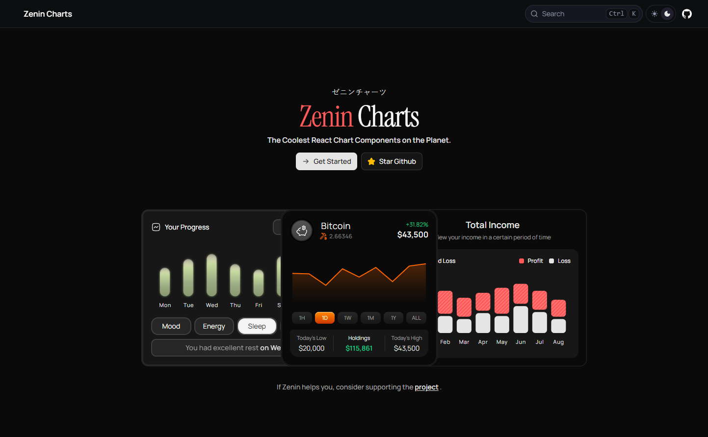

# Zenin Charts

<p align="center">
  The coolest React chart components on the planet.
</p>

<p align="center">
  
</p>

---

## ✨ Overview

**Zenin Charts** is a modern React chart component library designed to build **interactive and beautiful data visualizations** in web applications.

It provides prebuilt, customizable chart components that developers can easily integrate into their projects — with a strong focus on **design, usability, and smooth interactions**. :contentReference[oaicite:0]{index=0}

---

## 🔥 Why Zenin Charts?

- ⚡ Plug-and-play React components
- 🎨 Beautiful, modern UI (dark + light ready)
- 📊 Built for real-world dashboards & products
- 🧩 Easy integration into existing apps
- 🧠 Developer-first experience

---

## 🧱 What You Get

- Interactive chart components
- Financial-style UI examples
- Clean and reusable component architecture
- Documentation for quick setup
- Open-source flexibility

---

## 🎯 Target Developers

Zenin Charts is built for:

- React Developers
- Frontend Engineers
- Teams building dashboards, SaaS, or analytics tools

---

## 🛠 Tech Stack

- React
- TypeScript
- Modern UI/UX principles
- Component-driven architecture

---

## 🚀 Getting Started

Run the development server:

```bash
npm run dev
```

---

## 💡 Example Use Cases

- Admin dashboards
- Financial tracking apps
- Analytics platforms
- SaaS products
- Personal projects

---

## ❤️ Support the Project

### If Zenin Charts helps you, consider supporting the project:

<p align="left">
  <a href="https://buymeacoffee.com/vedantlamba">
    ☕ Support via Buy Me a Coffee
  </a>
</p>

---

## 📜 License

This project is open-source.

You can use, modify, and distribute it under the terms of the **MIT License**.
